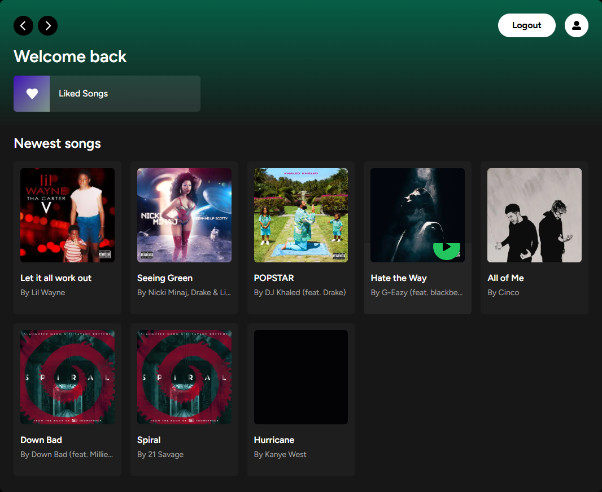
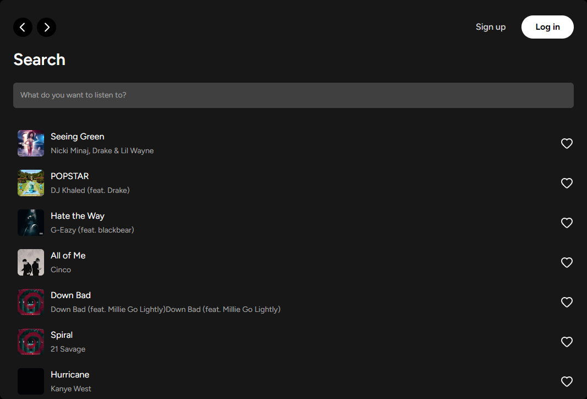

# SoundWave

Soundwave is a music streaming application built with the cutting-edge web technologies to ensure optimal performance and accessibility across all devices. The platform allows users to explore, play, add, and enjoy their favorite tracks effortlessly. The app's UI is inspired by the Spotify app.

## Features

- Responsive UI
- Music Player Functionality with the use-sound package
- User authentication with Supabse Auth
- Global State Management with Zustand
- Subcriptions Payment Integration with the Stripe API
- Form validation with React Hook Form and Zod

## Tech Stack

- **Framework:** Next.js
- **Styling:** Tailwind CSS
- **Database:** Supabase
- **State Management:** Zustand
- **Payment Gateway:** Stripe
- **Type Safety:** TypeScript
- **Form:** React Hook Form

## Screenshots

## Authors

Peter Uadiale

- [Website](https://www.peteruadiale.com/)
- [LinkedIn](https://www.linkedin.com/in/peter-o-uadiale-69541a19a/)
